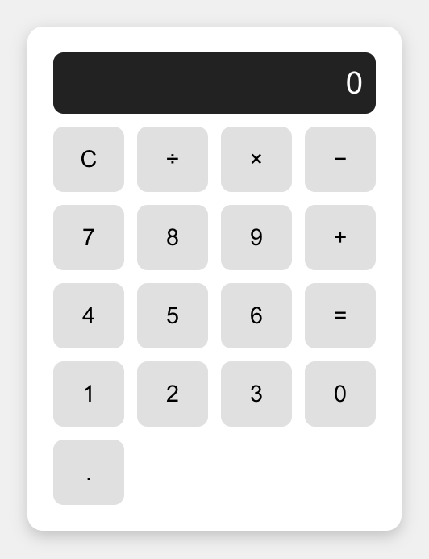

#  React Calculator App

A simple calculator app built with **React** that performs the four basic mathematical operations:  
➕ Addition, ➖ Subtraction, ✖️ Multiplication, and ➗ Division.

---

## 🚀 Getting Started

Clone the repo and install dependencies:

```bash
git clone https://github.com/your-username/calculator-app.git
cd calculator-app
npm install
npm start



